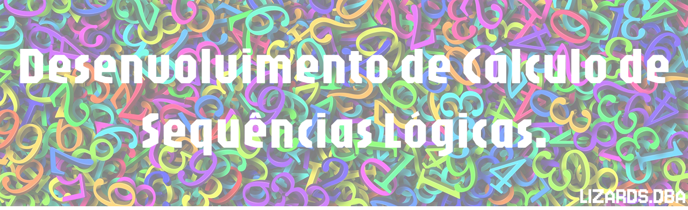

<!DOCTYPE html>
<html lang="pt-br">
<head>
    <meta charset="UTF-8">
    <meta name="viewport" content="width=device-width, initial-scale=1.0">
</head>
<body>

 

    

 

Somos estudantes do 1º semestre do curso de Banco de Dados na FATEC SJC, estamos dedicados ao desenvolvimento do projeto "Desenvolvimento de Cálculo de Sequências Lógicas" neste repositório. O projeto visa oferecer implementações de uma ampla variedade de operações matemáticas, em VisualG.

## Índice

♦ [Operações Disponíveis](#operações-disponíveis)  
♦ [Integrantes do projeto](#integrantes-do-projeto)  
♦ [Backlog do Produto](#backlog-do-produto)  
♦ [Manual do Usuário](#manual-do-usuário)  
♦ [Validações feitas com o Cliente](#validações-feitas-com-o-cliente)  
♦ [Requisitos de Permanência](#requisitos-de-permanência)  
♦ [Tecnologias Utilizadas](#tecnologias-utilizadas)  
♦ [Como Usar](#como-usar)  
♦ [Boas práticas](#boas-práticas)  
♦ [Contato](#contato)  
    
## Operações Disponíveis
   <ol>
        <li><b>Números Triangulares:</b> Números triangulares são números naturais que podem formar um triângulo equilátero de pontos, sendo calculados pela fórmula Tn = n x (n=1)/2, onde n é o número natural.</li>
        <li><b>Sequência Fatorial:</b> A sequência fatorial é formada pelo produto dos números naturais consecutivos, definida por 𝑛!=𝑛×(𝑛−1)×(𝑛−2)×⋯×1n!=n×(n−1)×(n−2)×⋯×1, com 0!=10!=1</li>
        <li><b>Sequência Alternada:</b> Uma sequência alternada é aquela em que os sinais dos termos variam de forma regular, como 𝑎𝑛=(−1)𝑛 ×𝑓(𝑛), alternando entre positivo e negativo. </li>
        <li><b>Sequência de Números Primos:</b> A sequência de números primos é composta por números naturais maiores que 1, que têm apenas dois divisores: 1 e eles mesmos, como 2, 3, 5, 7, 11, 13, entre outros.</li>
        <li><b>Sequência de Quadrados Perfeitos:</b> A sequência de quadrados perfeitos é formada pelos números que são o quadrado de números inteiros, como 1,4,9,16,25,36,…,ou seja, n2(n elevado a 2) onde n é um número inteiro.</li>
        <li><b>Sequência Geométrica:</b> A sequência geométrica é uma sequência de números em que cada termo após o primeiro é obtido multiplicando o termo anterior por uma constante chamada razão r, sendo expressa por an = a1 × r(n-1).</li>
        <li><b>Sequência de Fibonacci:</b> A sequência de Fibonacci é uma sequência numérica em que cada termo é a soma dos dois anteriores, começando por 0 e 1: 0,1,1,2,3,5,8,13,21,…. A fórmula é Fn = Fn-1 + Fn-2, com F0=0 e F1=1.</li>
        <li><b>Sequência Tribonacci:</b> A sequência Tribonacci é semelhante à sequência de Fibonacci, mas em vez de somar os dois termos anteriores, ela soma os três anteriores. A fórmula é Tn = Tn-1 + Tn-2 + Tn-3 , com os primeiros três termos sendo T0=0, T1=1 e T2=1. A sequência começa assim: 0,1,1,2,4,7,13,24,….</li>
        <li><b>Sequência de Cubos:</b> A sequência de cubos é formada pelos números que são o cubo de números inteiros, ou seja, n3(elevado a 3) como, 1,8,27,64,125,216,…. Cada termo é obtido elevando um número inteiro n ao cubo.</li>
        
</ol>
   
## Integrantes do projeto
  

  

## Backlog do Produto
<a href="https://docs.google.com/spreadsheets/d/1dDBVUDep0KgY49t9RhK5cnJx0stJFamzvc7hha6tZPc/edit?gid=0#gid=0" target="_blank">♦ Backlog Dinâmico</a>

| Sprint | Status | Descrição                                                             | Priorização |
|--------|----|-----------------------------------------------------------------------|-------------|
| 1,2 e 3      | Em andamento | Menu          |Alta  |
| 1      | Concluido:white_check_mark:  | Números Triangulares                                               |Alta  |
| 1      | Concluido:white_check_mark:  | Sequência Fatorial                                                 |Média |
| 1      | Concluido:white_check_mark:  | Sequência Alternada                                               |Alta |
| 2      | Em andamento  | Sequência Geométrica                                            |Alta |
| 2      | Em andamento | Sequência de Números Primos                  |Média|
| 2      | Em andamento  | Sequência de Quadrados Perfeitos                  |Baixa |
| 3      | Backlog  | Sequência Tribonacci                       |Média |
| 3      | Backlog  | Sequência de Fibonacci                                  |Baixa |
| 3      | Backlog  | Sequência de Cubos |Baixa|

## Manual do Usuário
<a href="https://manualapi.vercel.app/" target="_blank">♦ Manual do Usuário</a>

## Validações feitas com o Cliente

| Sprint | Validações | Respostas |
|------------|------------|-----------|
| 1          | Como deve ser o Menu? | Toda Sprint haverá mudanças e nessa só poderemos utilizar a função "SE" |
| 1          | As operações matemáticas que precisamos fazer ( em visualg), terão de ser entregues como? | O programa deve permitir que faça o cálculo de cada função.|
| 1          | Como devemos apresentar? | Deve-se apresentar o código rodando na hora e GitHub estruturado.|

## Requisitos de Permanência
Conversamos sobre alguns pontos importantes para que ninguém seja retirado do grupo e eles podem se atualizar durante o desenvolvimento do projeto.
- Reunião fixa: todas as quintas-feiras (aula vaga: 20:25 às 21:15);
- Cursos obrigatórios: Git e GitHub e Algoritmos (opção com Guanabara);
- Notion: Manter sempre o Backog atualizado
- Comunicação: sempre se comunique com o grupo pelo Whatsapp, pessoalmente para conseguir alinhar sobre as mudanças necessárias e ajudar o colega no projeto!
- Prazos: se atente aos prazos, lembre-se o projeto é importante para nossa conclusão do 1º semestre.

## Tecnologias Utilizadas

## Como Usar
<ol>
    <li>Clone o repositório:</li>
</ol>
<pre><code>git clone https://github.com/LizardsDBA/API-2025-1.git</code></pre>
<ol start="2">
    <li>Abra o código-fonte no VisualG.</li>
    <li>Execute o programa e siga as instruções para utilizar as operações desejadas.</li>
    <li>Após fazer alterações nos arquivos, adicione-os ao controle de versão:</li>
</ol>
<pre><code>git add .</code></pre>
<ol start="5">
    <li>Faça um commit das mudanças com uma mensagem descritiva:</li>
</ol>
<pre><code>git commit -m "Adiciona implementação da função "X"."</code></pre>
<ol start="6">
    <li>Envie as alterações para o repositório remoto:</li>
</ol>
<pre><code>git push origin main</code></pre>

 ## Boas práticas

 1. Sempre nomeie arquivos, funções ou funcionalidades utilizando camelCase é uma convenção de nomenclatura, onde as palavras são unidas sem espaços e cada palavra subsequente é capitalizada, exceto a primeira, como por exemplo o próprio nome da convenção: camelCase.
 2. Ao dar nome aos arquivos, funções ou ao fazer os commits, faça em inglês para exercitar o idioma e também é amplamente aceito como a língua padrão na indústria de tecnologia e programação. Usar nomes em inglês ajuda a manter a consistência e a interoperabilidade entre diferentes projetos e equipes ao redor do mundo.
 3. Ao realizar os commits utilize o pradrão: emoji + tipo do commit + breve descrição do que foi feito, se tiver dúvidas, dê uma olhada no repositório: 
[**Padrões de Commits**](https://github.com/arafaellacruz/padroes-de-commits)

## Contato

Se você tiver alguma dúvida, sugestão ou apenas quiser trocar uma ideia, sinta-se à vontade para me enviar um e-mail em [lizardsdba@gmail.com](mailto:lizardsdba@gmail.com). 
Estamos ansiosos para ouvir de você!

</body>
</html>
